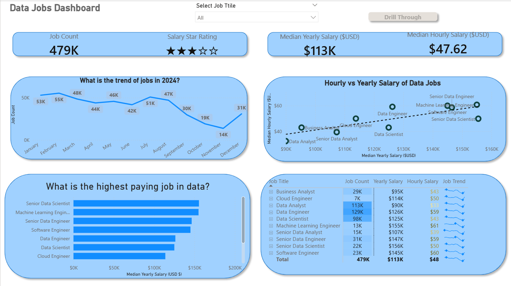
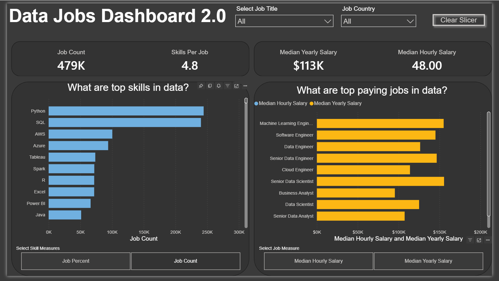

# My Power BI Dashboard Portfolio 📊

Welcome! This repository showcases a collection of Power BI dashboards I have built while exploring data analytics and visualization. It reflects my progression from creating basic reports to developing more advanced, interactive dashboards that transform raw data into meaningful insights.

# Featured Dashboards

Browse the dashboards below. Each project includes its own dedicated README containing detailed explanations about the dataset, design choices, and development process.

## 📈 Data Jobs Dashboard (V1 - Comprehensive Exploration)

[🌐 **View Interactive Dashboard on Power BI Service**](https://app.powerbi.com/groups/me/reports/16dee4de-3d2c-4e5a-9cbd-1815a05f63b0/f55ec0f5750153b850c6?experience=power-bi)

## Key Power BI Skills Demonstrated

| Category | Description |
|--------|-------------|
| 🎨 Dashboard Design | Dashboard Layout & User-Focused Design |
| ⚙️ Data Preparation | Power Query for Data Cleaning & Transformation (ETL) |
| 🔗 Data Modeling | Foundational Data Modeling with Table Relationships |
| 🧮 Measures & Aggregations | Implicit Measures and Aggregation Techniques |
| 📊 Data Visualization | Standard Visualizations (Bar, Line, Area, and Column Charts) |
| 🗺️ Geospatial Analysis | Geographic Mapping for Spatial Data Analysis |
| 🔢 KPIs & Reporting | KPI Cards and Structured Data Tables |
| 🎛️ Interactivity | Dynamic Slicers for Interactive Filtering |
| ⚪ Navigation | Buttons and Bookmarks for Page Navigation |
| ➡️ Deep Analysis | Drill-Through Features for Detailed Exploration |

💡 **Explore the Complete Project Documentation**

[➡️ **View Full Project 1 Details (README)**](./Data_Jobs_v1/README.md)

---

# 📊 Data Jobs Dashboard 2.0 (V2 - Single-Page Focus)

[🌐 **View Interactive Dashboard on Power BI Service**](https://app.powerbi.com/groups/me/reports/b4bc535c-f580-431a-bc5d-ec8a2540fae7/756f72689208505d03bc?experience=power-bi)

## Key Power BI Skills Utilized (demonstrating progression)

| Category | Description |
|--------|-------------|
| 🎨 Advanced Dashboard Design | Single-Page UX Design & Dashboard Optimization |
| ⚙️ Power Query Transformations | Complex Data Cleaning and Advanced Transformations |
| 🔗 Data Modeling | Star Schema Data Modeling Principles |
| 🧮 DAX Measures | Explicit DAX Measures (e.g., `CALCULATE`, context modifiers) |
| 📊 Dynamic Visualizations | Parameter-driven charts and slicer-based visual interaction |
| ⚙️ What-If Analysis | Field & Numeric Parameter Implementation |
| 🗺️ Geospatial Insights | Enhanced Geographic Data Visualization |
| 🔢 Advanced Cards | Advanced KPI and Card Visualizations |
| 🎛️ Filtering & Interaction | Optimized Slicers and Advanced Cross-Filtering |
| ✨ Performance Optimization | Report Performance and Optimization Techniques |

💡 **Explore the Complete Project Documentation**

[➡️ **View Full Project 2 Details (README)**](./Data_Jobs_v2/README.md)

---